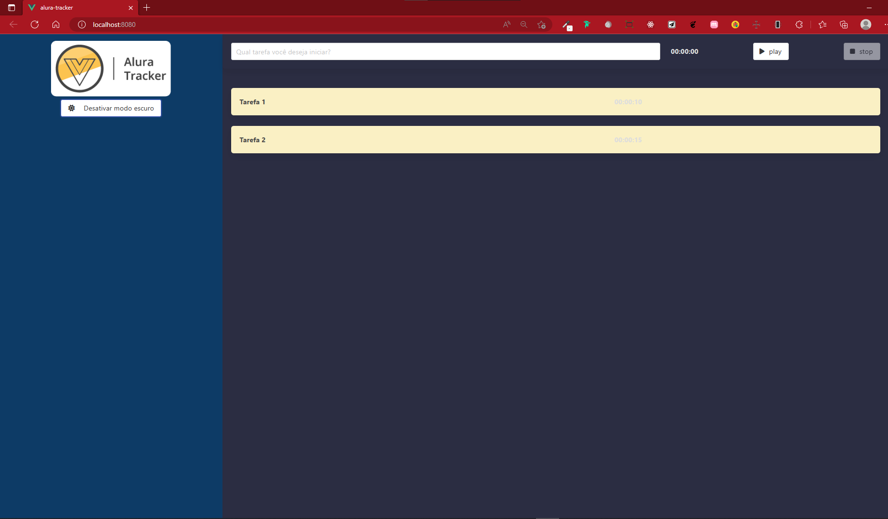

# alura-tracker


## Técnologias

Aqui estão as tecnológias utilizadas no projeto

* Vue 3
* TypeScript

## Project setup
```
npm install
```

### Compiles and hot-reloads for development
```
npm run serve
```

### Compiles and minifies for production
```
npm run build
```

### Lints and fixes files
```
npm run lint
```

### 1 - Projeto possui apenas uma página, essa que é a home.


### 2 - Página Home com tarefas executadas.


### 3 - Página Home com modo dark ligado.



